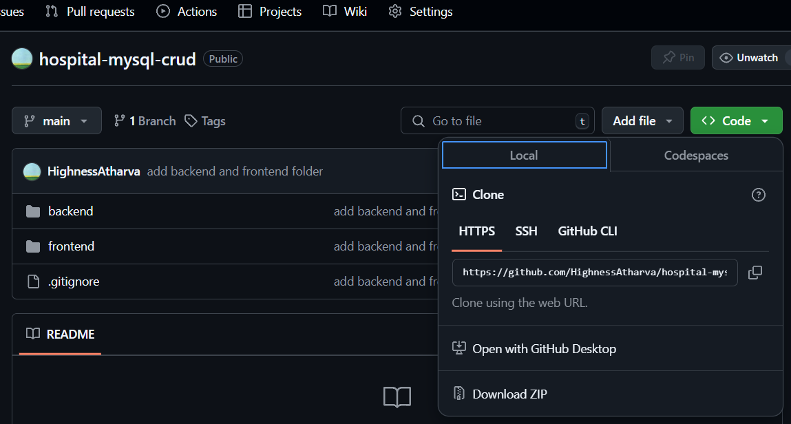
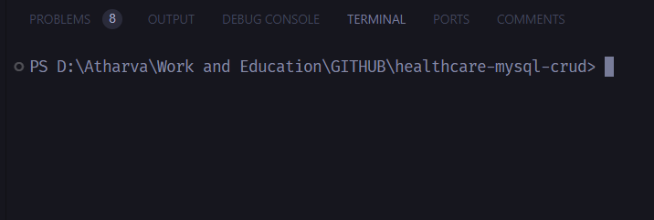
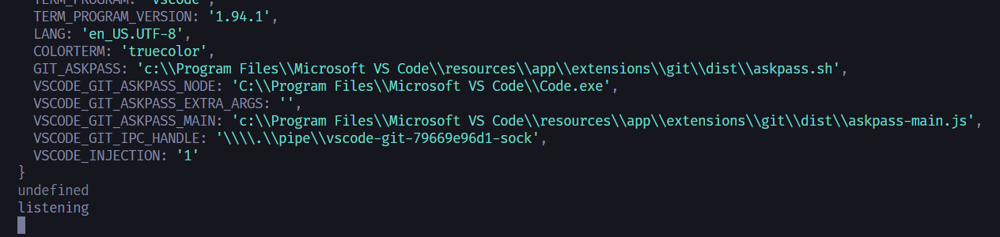
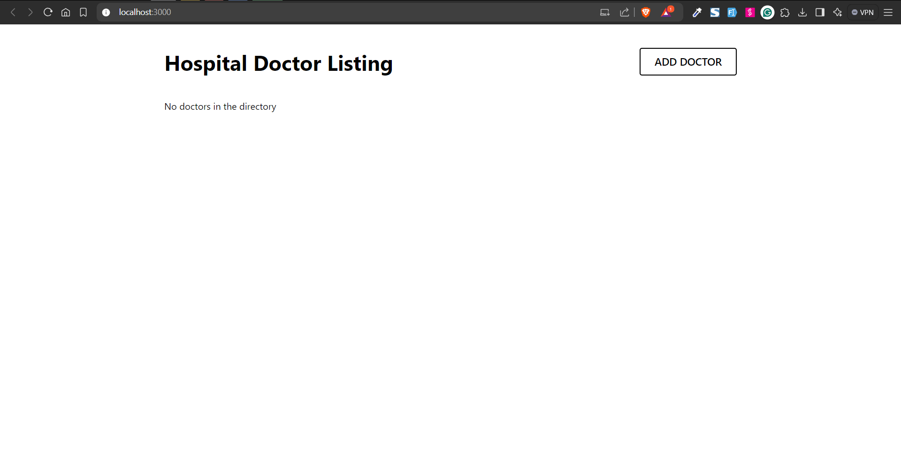

## Steps to Run

1. Download the ZIP file and extract it.


2. Open the terminal and navigate to the extracted folder.


3. Run the following command to install the required packages in the backend folder.:

```
cd backend
npm install
node index.js
```



4. In another terminal, Run the following command to install the required packages in the frontend folder.:

```
cd frontend
npm install
npm start
```

5. Visit http://localhost:3000/ to view the application.


